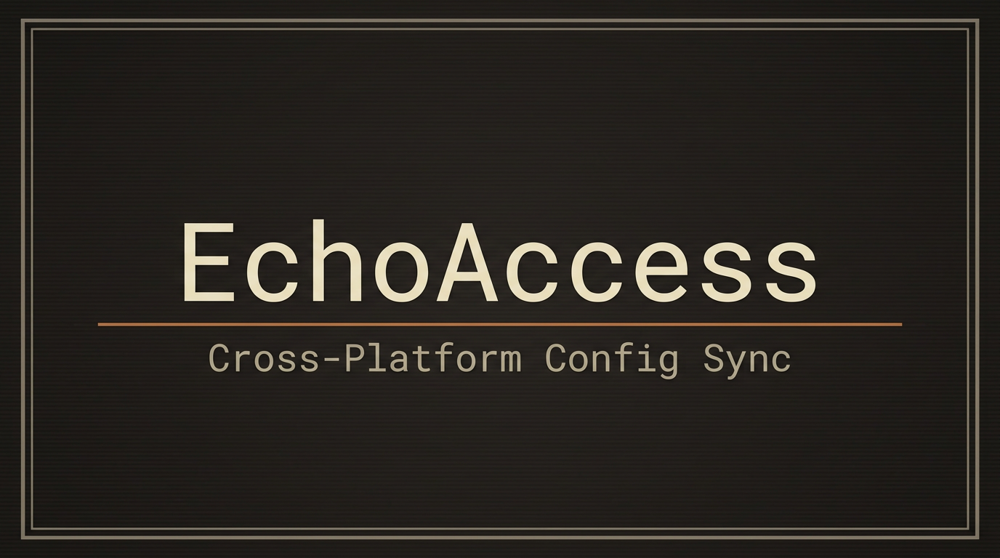
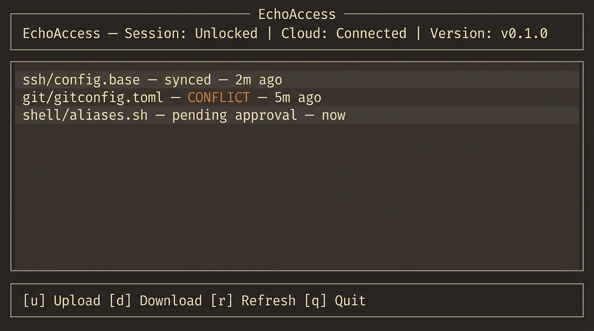

<p align="center">
  
</p>

<p align="center">
  <strong>Cross-platform configuration file synchronization with field-level encryption</strong>
</p>

<p align="center">
  <a href="https://github.com/nicholasjng/EchoAccess/actions"></a>
  <a href="LICENSE"></a>
  
  
  
</p>

---

## TUI Preview

<p align="center">
  
  <br>
  <sub>NieR: Automata inspired terminal interface</sub>
</p>

---

## Features

| | Feature | Description |
|---|---------|-------------|
| **Sync** | Profile-based sync | Per-device TOML profiles with field-level overrides and masking |
| **Security** | Dual encryption | `age` file encryption + AES-256-GCM field-level encryption |
| **Merge** | 3-way merge | Automatic merge with conflict detection and approval queue |
| **UI** | Triple interface | CLI (clap) + TUI (ratatui/NieR) + Web API (axum REST) |
| **Cloud** | Pluggable storage | S3-compatible backends via `CloudBackend` trait |
| **Devices** | SSH device push | Discover from `~/.ssh/config`, push configs via SSH |
| **Permissions** | Cross-platform | Policy-based permissions (POSIX + Windows) |
| **Updates** | Auto-update | GitHub Releases integration via `self_update` |
| **Portable** | Export/Import | Encrypted `.echoax.age` archive format |

---

## Architecture

```
echoax/
├── crates/
│   ├── echoax-core/        12 modules: config, crypto, device, error,
│   │                       permission, portability, profile, storage,
│   │                       sync, trigger, ui, updater
│   ├── echoax-cli/         CLI binary — clap subcommands
│   ├── echoax-tui/         TUI binary — ratatui + NieR: Automata theme
│   └── echoax-web/         Web API binary — axum REST + WebSocket
```

---

## Installation

### From GitHub Releases

Download the latest release for your platform:

```bash
# Linux x86_64
curl -fsSL https://github.com/nicholasjng/EchoAccess/releases/latest/download/echoax-v0.1.0-x86_64-unknown-linux-gnu.tar.gz | tar xz

# macOS Apple Silicon
curl -fsSL https://github.com/nicholasjng/EchoAccess/releases/latest/download/echoax-v0.1.0-aarch64-apple-darwin.tar.gz | tar xz
```

### From Source

```bash
git clone https://github.com/nicholasjng/EchoAccess.git
cd EchoAccess
cargo build --release --workspace
```

---

## Quick Start

```bash
# Initialize EchoAccess on this device
echoax-cli init

# Check sync status
echoax-cli status

# Validate a device profile
echoax-cli profile validate profiles/my-device.toml

# View configuration path
echoax-cli config path

# Sync files
echoax-cli sync upload
echoax-cli sync download

# Start the TUI dashboard
echoax-tui

# Start the Web API
echoax-web  # http://127.0.0.1:9876
```

---

## Device Profiles

Create a TOML profile for each device:

```toml
[device]
os = "linux"
role = "server"
hostname = "srv-01"

[[sync_rules]]
source = "ssh/config.base"
target = "~/.ssh/config"
transforms = ["strip_gui_hosts"]
masked_fields = ["Host desktop-*"]

[sync_rules.field_overrides]
"user.email" = "ops@company.com"
```

---

## Build & Test

```bash
cargo build --workspace          # Build all crates
cargo test --workspace           # Run 95 tests
cargo clippy --workspace         # Lint
cargo fmt --all --check          # Format check
```

### Release Build (all platforms)

```bash
./scripts/build-release.sh 0.1.0
```

Produces `dist/echoax-v0.1.0-{target}.tar.gz` for each platform.

---

## Design

EchoAccess uses a **NieR: Automata** inspired visual language:

| Token | Color | Usage |
|-------|-------|-------|
| Background | `#2E2A27` | Deep warm tone |
| Panel | `#4B413D` | Card backgrounds |
| Text | `#C3BDA8` | Primary content |
| Accent | `#C87941` | Warnings, actions |
| Success | `#A8B5A0` | Confirmations |
| Border | `#8B8070` | Separators |

*"Systematic and sterile, but also beautiful"*

---

## License

See [LICENSE](LICENSE) for details.
